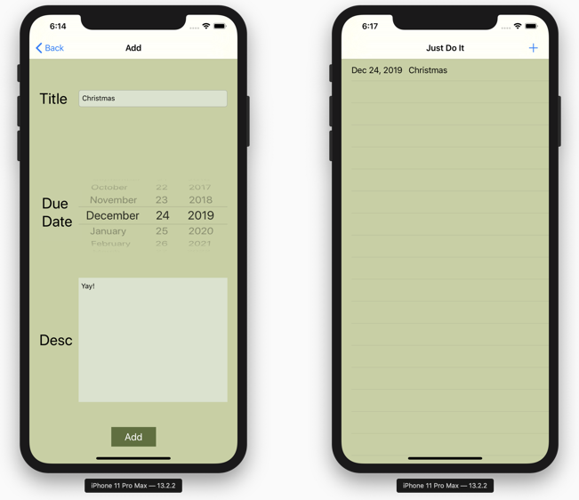
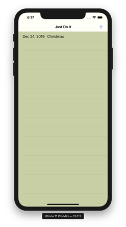
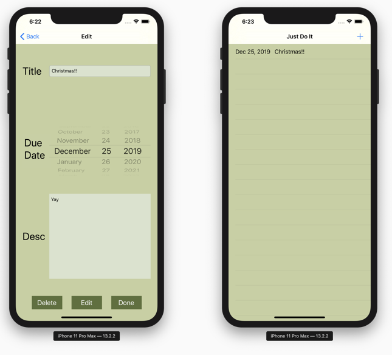
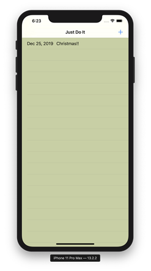
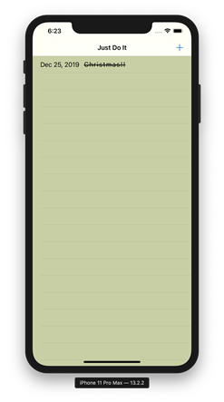

<h1> To Do List - Just Do It </h1>
 

Source Page: <a href="https://github.com/kellyshaprk/ToDoList_Swift" target="_blank"> https://github.com/kellyshaprk/ToDoList_Swift </a> 

 

<b>ADD</b>

User added Christmas on December 24th.

 

<b>EDIT</b>

User edited Christmas on December 25th.

 

<b>DONE</b>

